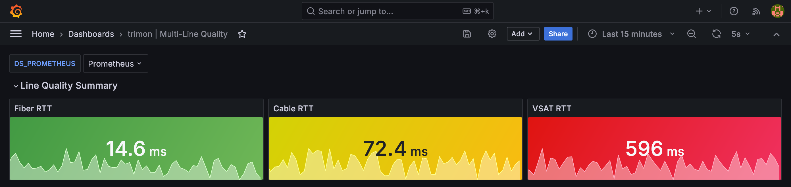

# trimon

*Push-based multi-line **T**arget **R**eachability **I**nspection and **MON**itoring for multi-homed networks*

[](LICENSE)
[](https://golang.org/)

trimon is an open-source, push-based multi-protocol IP target monitoring daemon that exports results to the OpenTelemetry stack. It is particularly useful in multi-line environments and SD-WAN setups where routing agents need continuous per-interface latency signals — not scrape-triggered snapshots. Pull-based tools like blackbox_exporter only measure when scraped, creating gaps between scrape intervals. trimon pushes results continuously from each source IP, running one goroutine per probe on its own configurable schedule.

---

## Multi-line demo

→ **[examples/multiline-demo/](examples/multiline-demo/README.md)**

Spins up a Docker Compose stack with three simulated WAN lines (fiber / cable / VSAT) and a pre-built Grafana dashboard showing per-line RTT, packet loss, and jitter side by side.

```bash
cd examples/multiline-demo
docker compose up -d --build
# Grafana: http://localhost:3001  →  trimon | Multi-Line Quality
```



---

## Key features

- **Push-based:** probes run on schedule, results export continuously — no scrape gaps
- **Multi-line `source_ip` per probe** — bind each probe to a specific interface IP
- Per-probe cadence override — run critical-path probes more frequently
- **OTel-native:** single MeterProvider feeds both `/metrics` (Prometheus bridge) and OTLP push
- Single static binary, no CGO, no runtime dependencies

---

## How it works

```
config files (--config / --probes)
    │
    ▼
Scheduler  (one goroutine + ticker per probe)
    │
    ▼
Probers  ──── bind to source_ip ────▶ ICMP echo
    │
    ▼
Result pipeline  (buffered channel, fan-in)
    │
    ▼
Exporters ──▶ stdout (optional)
          └──▶ OTLP ──▶ OTel Collector ──▶ Prometheus ──▶ Grafana
                    └──▶ Prometheus bridge  (/metrics)
```

---

## Quickstart

### Multi-line demo

See [examples/multiline-demo/](examples/multiline-demo/README.md) — the fastest way to see trimon working end-to-end with a full observability stack.

### Local binary

```bash
make build
sudo setcap cap_net_raw+ep ./bin/trimon
./bin/trimon --config config.example.yaml --probes probes.example.yaml
```

---

## Configuration reference

trimon uses two config files:

- **[config.example.yaml](config.example.yaml)** — ops config (`--config`): exporters, server listen address, pipeline buffer. Intended for ops use; never exposed via HTTP.
- **[probes.example.yaml](probes.example.yaml)** — probe config (`--probes`): global probe defaults and target list. Safe to expose to unprivileged users; returned by `GET /config`.

See [docs/config.md](docs/config.md) for the full design rationale.

**Probe fields:**

| Field | Default | Description |
|-------|---------|-------------|
| `name` | *(required)* | Unique probe identifier |
| `type` | *(required)* | Probe type (`icmp`) |
| `target` | *(required)* | Destination IP or hostname |
| `source_ip` | `""` (OS default) | Source interface IP to bind to |
| `probe_every` | global | How often to run this probe |
| `timeout` | global | Per-probe timeout |
| `count` | global | Number of ICMP packets per run |
| `packet_interval` | `1s` | Wait between individual packets |
| `labels` | `{}` | Arbitrary key-value labels attached to all metrics |

---

## Metrics reference

All metrics are served via the OTel Prometheus bridge. Instruments are defined once in
`internal/exporter/otlp/otlp.go` and exported to both `/metrics` and an optional OTLP
collector simultaneously.

**Probe result metrics** (attributes: `probe.name`, `probe.type`, `probe.target`, `probe.source_ip`, user labels):

| Metric | Type | Notes |
|--------|------|-------|
| `trimon_probe_rtt_min_milliseconds` | Gauge | 0 on failure/error |
| `trimon_probe_rtt_mean_milliseconds` | Gauge | 0 on failure/error |
| `trimon_probe_rtt_max_milliseconds` | Gauge | 0 on failure/error |
| `trimon_probe_rtt_stddev_milliseconds` | Gauge | 0 on failure/error |
| `trimon_probe_packet_loss_ratio` | Gauge | 1.0 on failure, NaN on error |
| `trimon_probe_packets_sent_total` | Counter | not incremented on error |
| `trimon_probe_packets_received_total` | Counter | not incremented on error |
| `trimon_probe_success` | Gauge | 1 if all packets replied |
| `trimon_probe_up` | Gauge | 1 if ≥1 reply; use this for alerting |

**Self-observability metrics:**

| Metric | Type | Labels |
|--------|------|--------|
| `trimon_build_info` | Gauge | `version`, `commit`, `goversion` |
| `trimon_probe_runs_total` | Counter | `probe.name` |
| `trimon_probe_errors_total` | Counter | `probe.name`, `error.type` |
| `trimon_probe_results_dropped_total` | Counter | `probe.name` — incremented when pipeline buffer is full |
| `trimon_scheduler_goroutines` | Gauge | — |
| `trimon_config_reloads_total` | Counter | — |

---

## HTTP endpoints

| Method | Path | Description |
|--------|------|-------------|
| `GET` | `/healthz` | Returns `200 {"status":"ok"}` while the process is running |
| `GET` | `/metrics` | Prometheus text format, self-observability metrics |
| `GET` | `/config` | Active config as JSON (pass `Accept: application/x-yaml` for YAML) |
| `POST` | `/reload` | Reload config from disk without restarting |

---

## Requirements

### CAP_NET_RAW (Linux)

ICMP probes require raw IP sockets. Run the binary as one of:

- `root`, or
- grant the capability: `sudo setcap cap_net_raw+ep ./bin/trimon`
- container: pass `--cap-add NET_RAW` to `docker run` / `podman run`

Without this, probes report `status: error` with
`"open raw socket (CAP_NET_RAW required): ..."`.

---

## Development

```bash
make test      # run unit tests with race detector
make lint      # run golangci-lint
make build     # compile binary to ./bin/trimon
make container # build container image (podman by default)
```

### Releasing

```bash
make release V=v0.1.0
git push origin v0.1.0
```

### Adding a new probe type

1. Create `internal/probe/<type>/<type>.go` implementing `probe.Prober`.
2. Add a case to the factory switch in `cmd/trimon/main.go`.
3. Add the type name to `knownProbeTypes` in `internal/config/config.go`.

### Adding a new exporter

1. Create `internal/exporter/<name>/<name>.go` implementing `exporter.Exporter`.
2. Instantiate and append to the `exporters` slice in `buildExporters` in `cmd/trimon/main.go`.
3. Add configuration fields to `ExportersConfig` in `internal/config/config.go`.

---

## License

[Apache 2.0](LICENSE)
