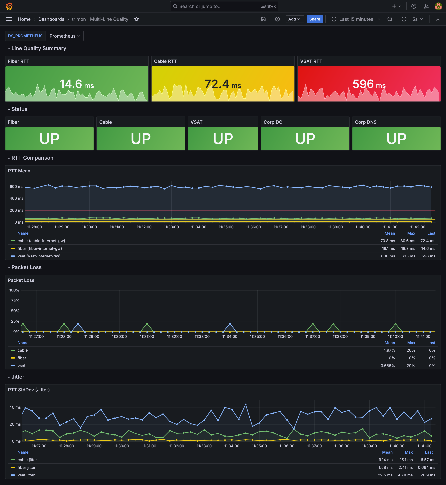

# trimon — Multi-Line Demo

Useful for SD-WAN routers, multi-homed servers, or any host with more than one upstream path — anywhere you need per-interface latency visibility rather than a single averaged view. This demo simulates three WAN lines (fiber, cable, VSAT) using `tc netem` to inject realistic latency and packet loss, and shows how trimon's `source_ip` binding keeps each probe on its own interface.



## Prerequisites

- Docker or Podman with Compose v2
- Internet access for `docker pull`

## Run

```bash
docker compose up -d --build
```

Grafana: http://localhost:3001 → **trimon | Multi-Line Quality**

## Expected values

| Line  | RTT    | Loss |
|-------|--------|------|
| Fiber | ~15 ms | 0%   |
| Cable | ~70 ms | ~3%  |
| VSAT  | ~600 ms | ~1% |

## Simulate a failure

```bash
docker compose stop target-vsat   # VSAT turns red in ~15 s
docker compose start target-vsat  # recovers in one probe cycle
```

## Stop

```bash
docker compose down -v
```

> **tc netem note:** delay is applied to the reply path only, so measured RTT ≈ the configured delay value.
